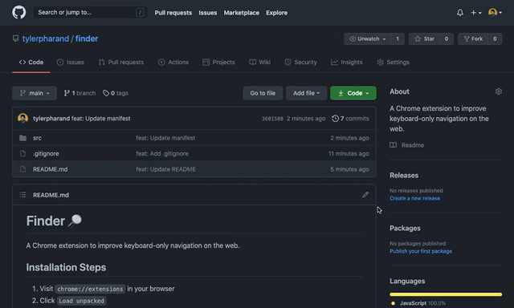

# Finder 🔎

A Chrome extension to improve keyboard-only navigation on the web.

## Installation Steps
1) Run `build.sh` to compile extension
2) Visit `chrome://extensions` in your browser
3) Click `Load unpacked`
4) Select the `bin` directory
5) Done!

## Usage
- On any web page, hold `Control` and begin typing to search for focusable elements. Matches will be highlighted.
- Use `Tab` to focus between highlighted elements (`Shift + Tab` to move backwards)
- Press `Return` to click on the currently focused element.
- Press `Esc` to dismiss Finder

